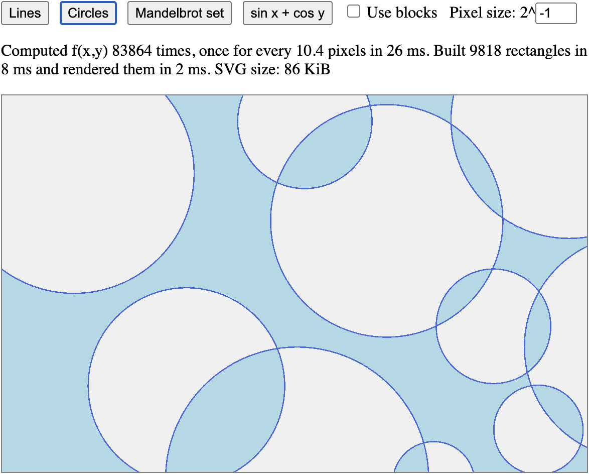

# Contour Plot

[](https://npmjs.org/package/contour-plot-svg "View this project on npm")
[](https://opensource.org/licenses/MIT)

**Contour Plot** is a TypeScript library designed for efficient plotting of functions that map (x, y) points to a limited set of discrete values. The library evaluates the function at grid points with configurable density, refines boundaries where neighboring grid points produce different values, and generates a list of squares or runs (unit-height rectangles). Within each square or run, the function's value is treated as constant. The coordinates of the building blocks are selected so that they can be precisely and efficiently rendered as SVG.

## Example usage

The following TypeScript code snippet will create an SVG and draw a filled hyperbola:

```typescript
document.body.innerHTML = `
    <svg style="width: 100%; height: calc(100vh - 20px)">
      <g id="plot"/>
    </svg>`;
const svg = document.querySelector('svg')!;
const plot = svg.querySelector('#plot') as SVGElement;

const hyperbola = (x: number, y: number) => x * y > 10000;

const width = svg.clientWidth;
const height = svg.clientHeight;
const domain = {x: -width / 2, y: -height / 2, width, height};
plot.style.transform = `translate(${-domain.x}px, ${-domain.y}px)`;

plot.append(...squaresToSvg(
    new Plot(hyperbola)
        .compute(domain, /* sampleSpacing= */ 128, /* pixelSize= */ 1)
        .squares(),
    /* addStyles= */ (isInside, el) => {
      el.style.stroke = isInside ? 'olive' : 'lightgreen';
    }));
```

## Demo

To run a demo, build it with `npm run build`, start a web server with `npm run preview`, then open http://localhost:4173  
There you can select a function to plot, specify the resolution, and optionally highlight the edges of the building blocks.


